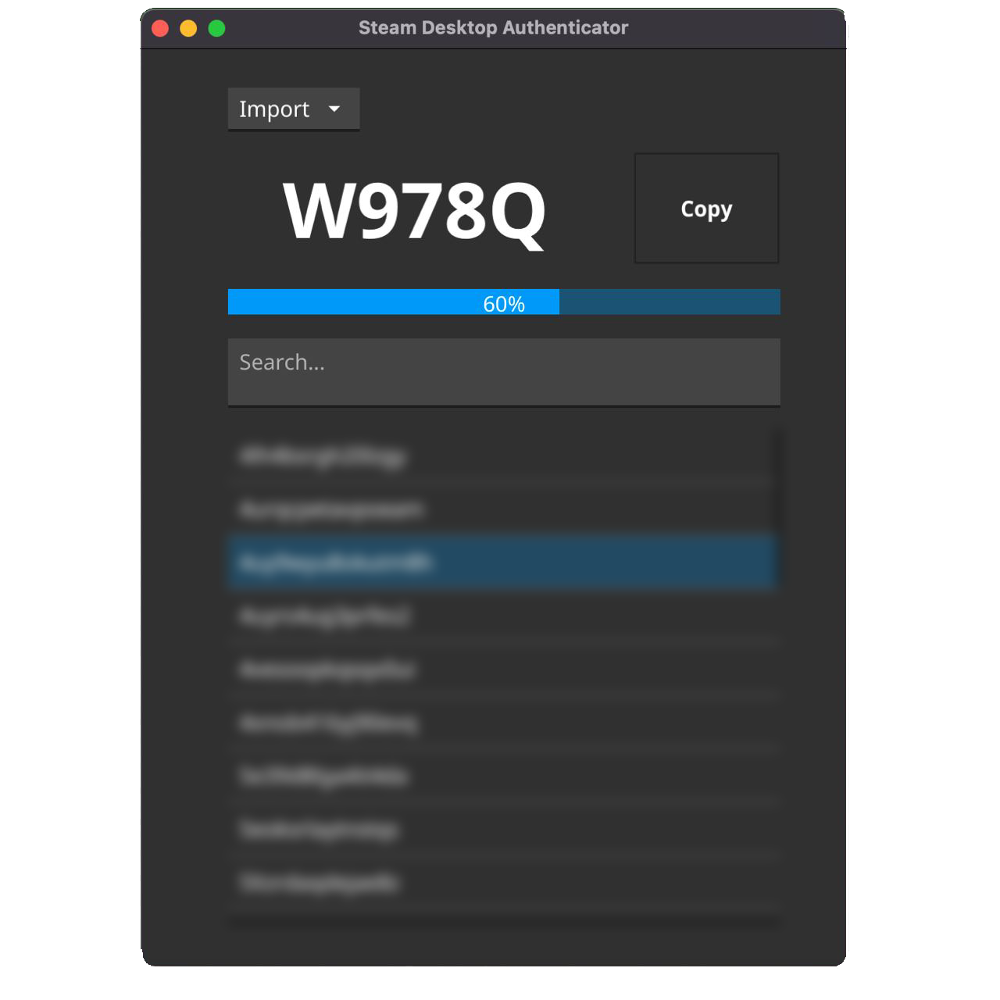

<h1 align="center">
    
    </br>
    SDA Multiplatform
</h1>

## Warning

This product comes as is, which means that I don't provide any support, and the project only develops because of the community that uses it. I also don't take any responsibility for how this app will be used, so if you lose your accounts, the blame will be on you. 

## Description

This project is analogous to [Steam Desktop Authenticator](https://github.com/Jessecar96/SteamDesktopAuthenticator) which is Windows-native application. Main idea of this project is cross-platform, which allow you to run application out of the box on all of your devices at once. For now, application supports running on MacOS, Linux, Windows.

## How to use

- Download relevant version of application from [Releases](https://github.com/tre3p/steam-desktop-authenticator-multiplatform/releases) page.
- Extract application to any folder you want, put your maFiles to maFiles folder and launch the application with following command on Linux/MacOS:

```sh
chmod +X sda-multiplatform
./sda-multiplatform
```

## Build

### Windows

- Download and install [Go](https://go.dev/dl/)
- Install GCC compiler
- Install Fyne CLI
```sh
go install fyne.io/fyne/v2/cmd/fyne@latest
```
- Clone project
- Navigate to folder in which you downloaded application and execute command:
```sh
fyne package
```
- After you see the executable - place it in another folder and launch it
- You will see GUI and folder maFiles in folder in which you place executable. Fill this with your maFiles and start using

### Linux

- Download and install [Go](https://go.dev/dl/)
- Install GCC compiler
- Install Fyne CLI
```sh
go install fyne.io/fyne/v2/cmd/fyne@latest
```
- Clone project
- Navigate to folder in which you downloaded application and execute command:
```sh
fyne package
```
- You will see linux executable file. Place it in another folder, launch it, and it will create maFiles directory. Fill maFiles directory with your maFiles
- Launch application again

### MacOS

Coming soon. For now, only executable script available. You can build and launch it using following commands:

```sh
go build
```

