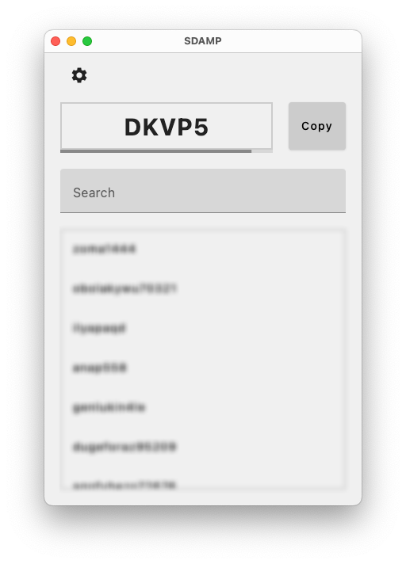

<h1 align="center">
    
    </br>
    SDAMP (Steam Desktop Authenticator Multiplatform)
</h1>

## Warning

This product comes as is, which means that I don't provide any support, and the project only develops because of the community that uses it. I also don't take any responsibility for how this app will be used, so if you lose your accounts, the blame will be on you.

## Description

This project is analogous to [Steam Desktop Authenticator](https://github.com/Jessecar96/SteamDesktopAuthenticator) which is Windows-native application. Main idea of this project is cross-platform, which allow you to run application out of the box on all of your devices at once. For now, application supports running on MacOS, Linux, Windows.

## How to use

- Download relevant version of application from [Releases](https://github.com/tre3p/steam-desktop-authenticator-multiplatform/releases) page.
- Proceed with installation based on system you use

## Build

### Windows

- Clone project
- Navigate to folder in which you downloaded application and execute command:
```sh
gradlew.bat packageDistributionForCurrentOs
```
- Executable file will be placed in `sdamp-ui/build/compose/binaries/main/app/` folder


### Linux

- Clone project
- Navigate to folder in which you downloaded application and execute command:
```sh
chmod +x gradlew
./gradlew packageDistributionForCurrentOs
```
- Executable file will be placed in `sdamp-ui/build/compose/binaries/main/app/` folder

### MacOS

- Clone project
- Navigate to folder in which you downloaded application and execute command:
```sh
chmod +x gradlew
./gradlew packageDistributionForCurrentOs
```
- Executable file will be placed in `sdamp-ui/build/compose/binaries/main/app/` folder

